# 🏦 Bank Management System – Front End (React.js)

## 📄 Description
This project is the front-end for a Bank Management System built with React.js. The application allows employees to log in and view financial data such as transaction history, account balances, and loan details.

The frontend was developed using **React.js**, while the backend was fully implemented using **Java Spring Boot** in a separate repository. You can connect the two by following the instructions below.

---

## 🎥 Video Demo

<video width="700" controls>
  <source src="bank_2IkKv3WU.mp4" type="video/mp4">
  Your browser does not support the video tag.
</video>

You can view it on Google Drive:  
🔗 [Watch Demo](https://drive.google.com/file/d/1jk_9iyIPoyBeOTzkMQ8w1HoY5Gcorvis/view?usp=sharing)

---

## 🛠️ Features
- 🔐 **Login with Role Detection**: Supports both **Employee** and **Customer** login based on user roles.
- 📧 **Email Verification**: Secure one-time password system for user authentication.
- 🛡️ **Role-Based Authorization**: Access control tailored to user roles (employee vs. customer).
- 💰 **Transaction History**: View and manage account activity.
- 🧾 **Account Balances**: Real-time updates for customer accounts.
- 🏦 **Loan Management**: Track loan applications, statuses, and repayments.
- 📊 **Chart Visualization**: Graphs and charts to visualize financial trends.
- 📱 **Responsive UI**: Fully responsive design using React and Reactstrap.

---

## 💻 Tech Stack
- **Frontend**: React.js, Axios, Chart.js, React Router, Reactstrap  
- **Backend**: Java Spring Boot (separate repository)  
- **Authentication**: JSON Web Token (JWT)  
- **State Management**: React Hooks (`useState`, `useEffect`)  

---

## 🔗 How to Connect Frontend with Backend

1. Clone the backend repository and run it on `http://localhost:8080`.
2. Ensure your backend allows CORS from the frontend.
3. Update `src/axios.js`:

```js
const API_BASE_URL = "http://localhost:8080";
```

4. Install and run both projects:

**Frontend:**

```bash
npm install
npm start
```

**Backend:**  
Follow instructions provided in the backend repository.

---

## ⚙️ Installation

```bash
git clone https://github.com/yourusername/Bank-Management-System-Front-End-React.js-.git
cd Bank-Management-System-Front-End-React.js
npm install
npm start
```

Visit the app at: [http://localhost:3000](http://localhost:3000)

---

## 📸 Screenshots

### 🔐 Login & Signup

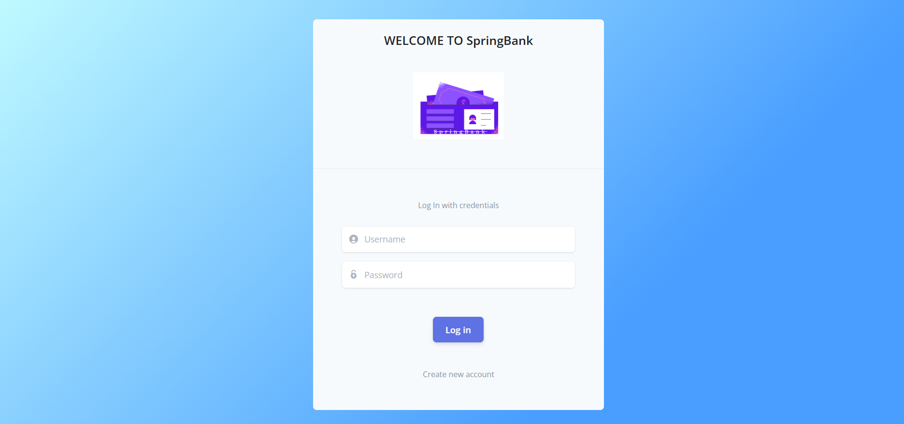  
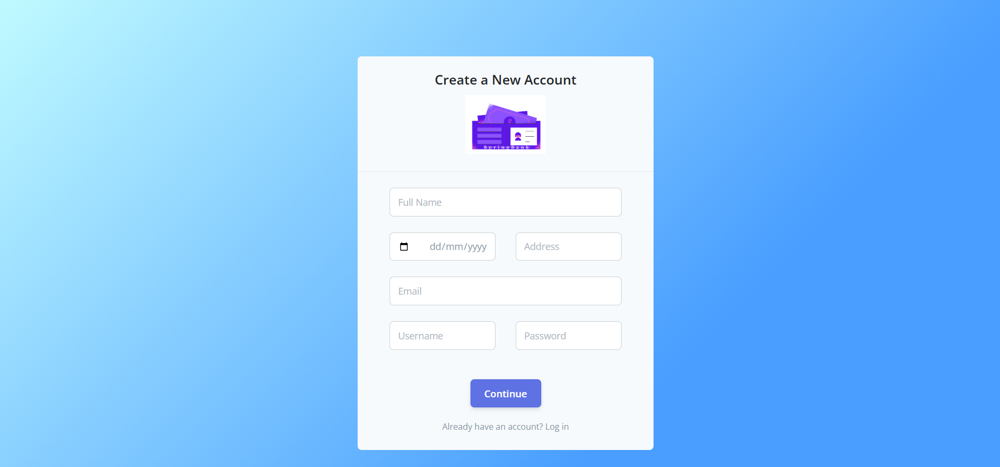

---

### 👤 Customer Views

**Home Page**  
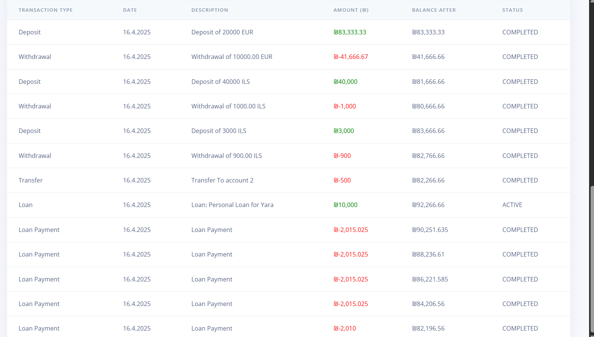  
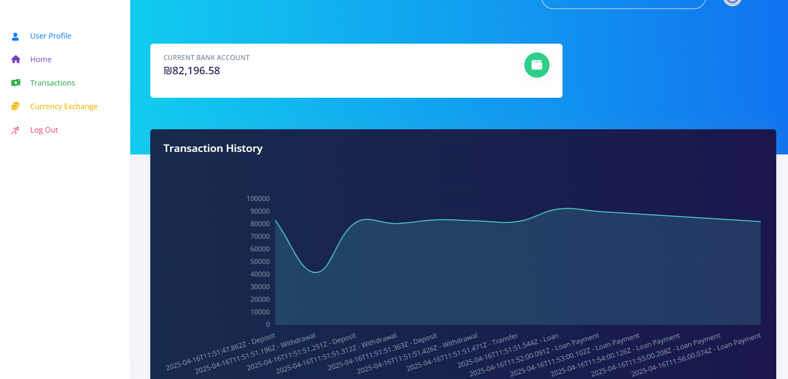

**User Dashboard View**  
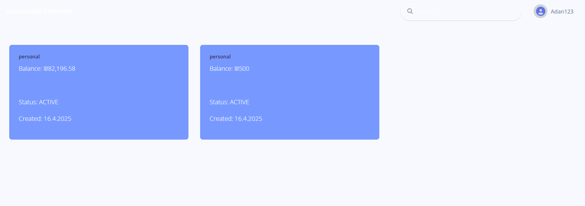

**User Profile**  
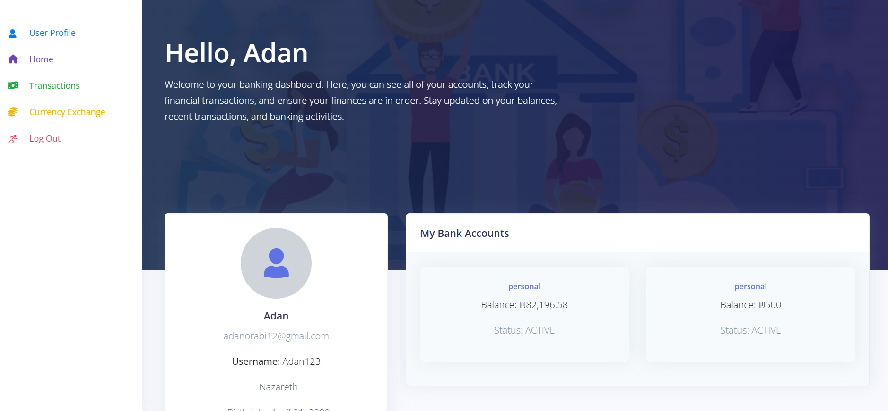

**Transactions **  
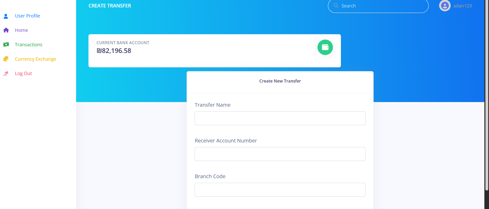  
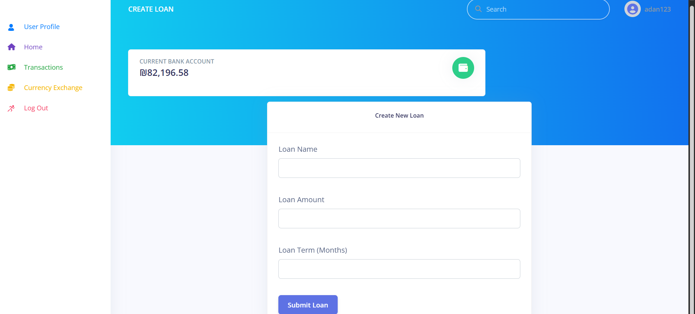

**Loans**  
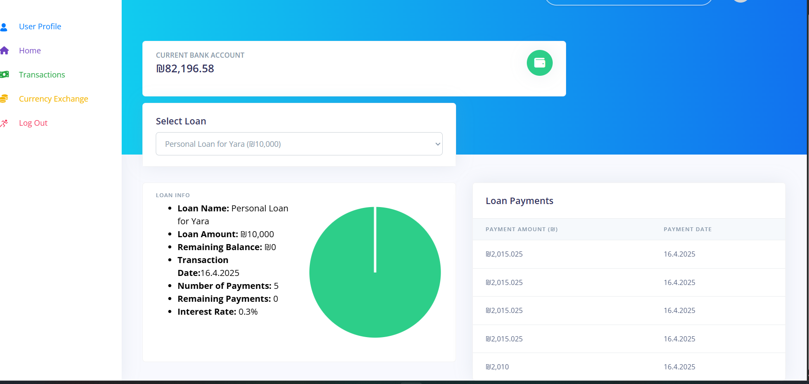

---

### 🧑‍💼 Employee Views

**Employee Dashboard**  


**Management Panel**  
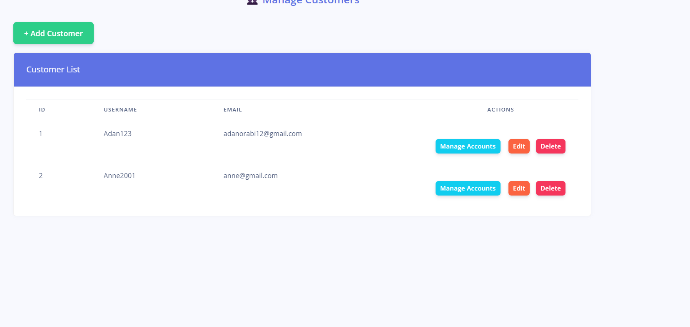  
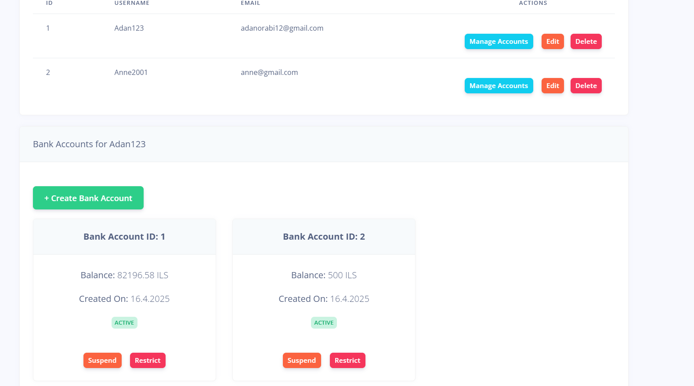

---

## 📝 License
This project is licensed under the MIT License - see the [LICENSE](LICENSE) file for details.

---

## 🤝 Acknowledgements
- UI components and layout design were adapted from  
  💡 [Creative Tim – Argon Dashboard React]([https://drive.google.com/file/d/1jk_9iyIPoyBeOTzkMQ8w1HoY5Gcorvis/view?usp=sharing](https://github.com/creativetimofficial/argon-dashboard-react))
-Thanks to Creative Tim for their beautiful open-source dashboard!
- The **backend was fully implemented from scratch** by us and customized to connect seamlessly with this React front-end.
